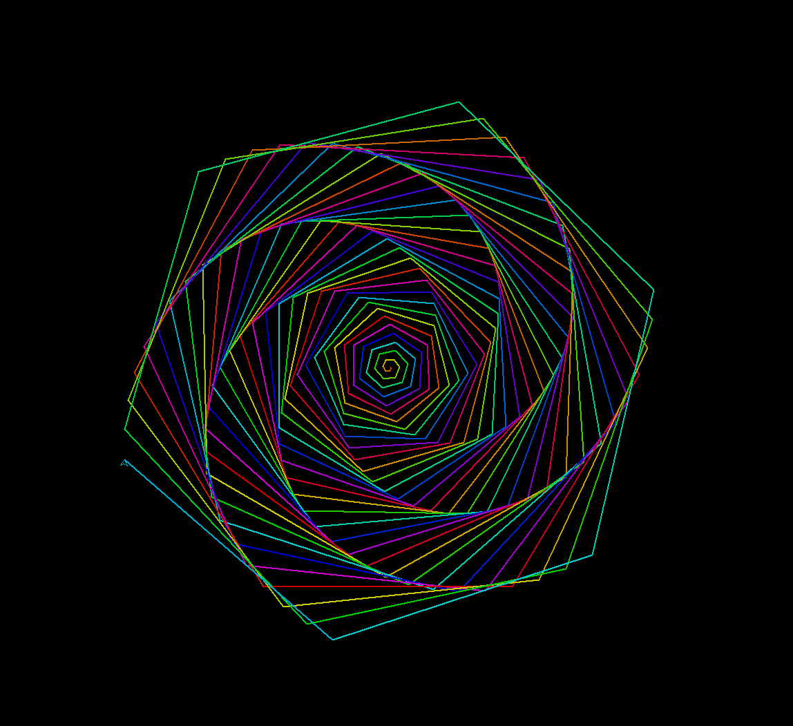

# Meine Python-Lernreise 🚀

In diesem Repository speichere ich meine Fortschritte beim Python-Lernen und die Codes, die ich zum Üben geschrieben habe.

## 1. Turtle-Spiralmuster 🌀
Dieser Code zeichnet eine mathematische Spirale mithilfe der `turtle`-Bibliothek.

### Ergebnis:

### Gelerntes:
- Verwendung von `for`-Schleifen
- Verwendung von `colorsys` zur Farberzeugung
- Grafische Visualisierung# my-python-learning-
